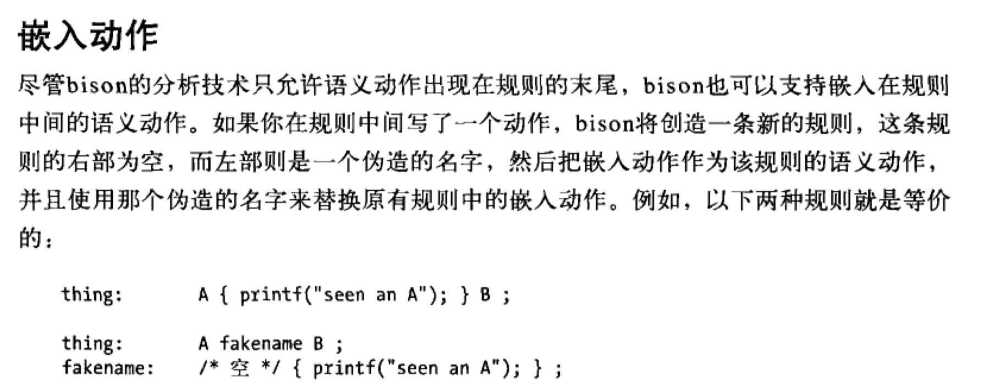

## PA3
要先`make lexer`再`perl pa2-grading.pl`
这样flex把输入流分解为若干个片段(记号),然后bison则分析这些记号并基于逻辑进行组合。

**要先看[PA2.pdf](https://courses.edx.org/assets/courseware/v1/4d4e0c23c74c47af7be1efdddfff4e0c/asset-v1:StanfordOnline+SOE.YCSCS1+1T2020+type@asset+block/PA2.pdf)再看[The Cool Reference Manual](https://courses.edx.org/assets/courseware/v1/27e1a38f1161e61d91c25a4b1805489b/asset-v1:StanfordOnline+SOE.YCSCS1+1T2020+type@asset+block/cool_manual.pdf) 和 [Tour of the Cool Support Code](https://courses.edx.org/assets/courseware/v1/115f9c1f48cffa3192f23dc37c3a4eee/asset-v1:StanfordOnline+SOE.YCSCS1+1T2020+type@asset+block/cool-tour.pdf)**

然后再翻翻[flex与bison中文版](https://github.com/mrbelieve128/book_list/blob/master/flex%E4%B8%8Ebison%E4%B8%AD%E6%96%87%E7%89%88.pdf)

我感觉是照着同文件夹下的cool-tree.aps写对应的规则

> For example, the definition of the constructor of class is as follows:
>
> ```
> constructor class_(name : Symbol; parent: Symbol;
>     features : Features; filename : Symbol): Class_;
> ```
>
> The parsing rule is as follows:
>
> ```
> class   : CLASS TYPEID '{' feature_list '}' ';' {
>             $$ = class_($2, idtable.add_string("Object"), 
>                 $4, stringtable.add_string(curr_filename));
>         }
>         | CLASS TYPEID INHERITS TYPEID '{' feature_list '}' ';' {
>             $$ = class_($2, $4, $6,
>                 stringtable.add_string(curr_filename));
>         }
>         ;
> ```

就拿这个例子来说

`CLASS TYPEID '{' feature_list '}' ';'`

这部分是匹配的cool中的class 写法，如

```
class Hello {
   foo: Int;
};
```

而至于最前面的`class :` 见下图（截图自 flex与bison中文版



